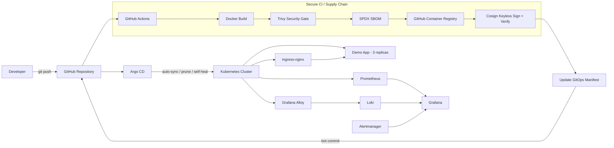

# DevOps GitOps Lab

[](https://github.com/TortelloSte/devops-lab-gitops/actions/workflows/ci.yml)

A hands-on **Platform Engineering / DevOps lab** built around a local three-node Kubernetes cluster and a production-style GitOps delivery workflow.

The project demonstrates how application changes move from Git to Kubernetes through a secured software supply chain:

**GitHub Actions → Docker build → Trivy → SPDX SBOM → GHCR → Cosign keyless signing → GitOps manifest update → Argo CD → Kubernetes**

The goal is not to collect tools, but to show how the major components of a modern internal platform fit together and how they behave under real reconciliation, deployment, observability, and security workflows.

---

## What this project demonstrates

- Kubernetes platform operations on a reproducible multi-node `kind` cluster
- Continuous delivery through **GitOps** rather than direct CI-to-cluster deployment
- Automated container build and publication to **GitHub Container Registry**
- Vulnerability gating with **Trivy**
- **SPDX JSON SBOM** generation for every successful build
- Keyless container signing and verification with **Cosign + GitHub OIDC**
- Immutable Kubernetes deployments using image **SHA-256 digests**
- Continuous reconciliation, self-healing, and pruning with **Argo CD**
- Metrics, dashboards, alerting, and centralized logs
- Kubernetes policy and secrets-management tooling
- End-to-end verification from source commit to live HTTP response

---

## Architecture



More detail: [`docs/architecture.md`](docs/architecture.md)

---

## Secure CI/CD Pipeline

The workflow is defined in:

```text
.github/workflows/ci.yml
```

### Delivery flow

```text
Source change
    ↓
Docker build
    ↓
Trivy vulnerability gate
    ↓
SPDX JSON SBOM
    ↓
GHCR publish
    ↓
Resolve immutable image digest
    ↓
Cosign keyless signing with GitHub OIDC
    ↓
Signature verification
    ↓
Update apps/demo/deployment.yaml
    ↓
github-actions[bot] commit
    ↓
Argo CD detects Git change
    ↓
Kubernetes rollout
```

### Security properties

The pipeline deliberately separates build validation from publication.

- The image is built locally inside GitHub Actions first.
- Trivy blocks the pipeline on **fixable HIGH or CRITICAL vulnerabilities**.
- An SPDX JSON SBOM is generated and stored as a GitHub Actions artifact.
- Only after the security gate passes is the image pushed to GHCR.
- Cosign signs the immutable registry digest using **GitHub OIDC**, so no long-lived signing key is stored in repository secrets.
- The signature is verified before the GitOps deployment manifest is changed.
- Kubernetes deploys the image by immutable digest, not by a mutable `latest` tag.

Example deployed reference:

```text
ghcr.io/tortelloste/devops-lab-demo@sha256:<digest>
```

---

## GitOps

Application state lives in Git and is reconciled by Argo CD.

Argo CD is configured with:

- automated synchronization
- self-healing
- automatic pruning
- automatic namespace creation

The CI workflow **does not run `kubectl apply`**.

Instead, after an image has passed security checks and signature verification, GitHub Actions updates the Kubernetes Deployment manifest and creates a Git commit. Argo CD detects that change and performs the rollout.

This keeps **Git as the source of truth** and separates CI responsibilities from cluster reconciliation.

### Self-healing verification

Manual changes made directly in Kubernetes were tested and automatically reverted by Argo CD to match the desired state stored in Git.

---

## Kubernetes Environment

The local platform runs on `kind` with three nodes:

```text
devops-lab
├── 1 control-plane
├── 2 workers
└── ingress-nginx exposed through host ports 80/443
```

The demo application runs with **3 replicas** and is distributed across the worker nodes.

Application endpoint:

```text
http://demo.local
```

Traffic flow:

```text
Browser
  ↓
demo.local
  ↓
localhost:80
  ↓
kind control-plane
  ↓
ingress-nginx
  ↓
Kubernetes Service
  ↓
Demo Pods
```

---

## Observability

The cluster includes a complete metrics and logging path.

| Component | Role |
|---|---|
| Prometheus | Cluster and workload metrics |
| Grafana | Metrics and log visualization |
| Alertmanager | Alert routing and handling |
| metrics-server | Kubernetes resource metrics |
| Loki | Centralized log storage and querying |
| Grafana Alloy | Log collection and forwarding |

Grafana is connected to real cluster telemetry, and Loki receives logs through Alloy.

---

## Security and Secrets

| Component | Purpose |
|---|---|
| Trivy | Container vulnerability scanning |
| Cosign | Container signing and verification |
| Kyverno | Kubernetes policy enforcement |
| SOPS + age | Encrypted secrets stored safely in Git workflows |
| External Secrets Operator | External secret integration |

The CI/CD pipeline additionally uses GitHub OIDC for keyless signing.

---

## Demo Application

The demo container is intentionally small. Its purpose is to make the delivery path easy to verify rather than to add application complexity.

```text
app/
├── Dockerfile
└── index.html
```

Kubernetes manifests:

```text
apps/demo/
├── deployment.yaml
├── ingress.yaml
└── service.yaml
```

Expected response:

```html
<h1>DevOps Lab</h1>
<p>Deployed through GitOps with Argo CD.</p>
```

---

## Repository Structure

```text
.
├── .github/
│   └── workflows/
│       └── ci.yml
├── app/
│   ├── Dockerfile
│   └── index.html
├── apps/
│   └── demo/
│       ├── deployment.yaml
│       ├── ingress.yaml
│       └── service.yaml
├── argocd/
│   └── apps/
│       └── demo.yaml
├── clusters/
│   └── local/
│       └── kind-cluster.yaml
├── docs/
│   └── architecture.md
└── README.md
```

---

## Verified End-to-End

The current implementation has been verified through the complete delivery path:

```text
Git push
  ↓
GitHub Actions
  ↓
Docker build
  ↓
Trivy gate
  ↓
SPDX SBOM
  ↓
GHCR
  ↓
Cosign sign + verify
  ↓
GitOps bot commit
  ↓
Argo CD auto-sync
  ↓
Kubernetes rollout
  ↓
3 running replicas
  ↓
Ingress
  ↓
demo.local HTTP 200
```

The running pods were also verified to use the exact immutable digest produced and signed by the CI pipeline.

---

## Key Design Decisions

### GitOps instead of direct deployment from CI

GitHub Actions never needs Kubernetes credentials. CI produces and verifies the artifact, then updates desired state in Git. Argo CD owns deployment and reconciliation.

### Immutable image references

Deployments use `image@sha256:<digest>` rather than mutable tags. This ties the running workload to the exact artifact that passed Trivy and Cosign verification.

### Keyless signing

Cosign uses GitHub OIDC instead of a long-lived private signing key. This reduces secret-management overhead and produces verifiable workload identity for signatures.

### Security gate before publication

Fixable HIGH and CRITICAL vulnerabilities block the pipeline before the container is published and deployed.

---

## Technology Stack

### Platform

- Kubernetes
- kind
- Docker
- ingress-nginx
- Helm

### GitOps and Delivery

- GitHub Actions
- Argo CD
- GitHub Container Registry

### Observability

- Prometheus
- Grafana
- Alertmanager
- Loki
- Grafana Alloy
- metrics-server

### Security and Secrets

- Trivy
- Cosign / Sigstore
- Kyverno
- SOPS
- age
- External Secrets Operator

---

## Project Status

**Current status: functional end-to-end platform engineering portfolio project.**

Implemented and verified:

- [x] Three-node local Kubernetes cluster
- [x] ingress-nginx
- [x] Argo CD automated GitOps reconciliation
- [x] GitOps self-healing and pruning
- [x] Prometheus / Grafana / Alertmanager
- [x] Loki / Grafana Alloy centralized logging
- [x] External Secrets Operator
- [x] Kyverno
- [x] Container CI with GitHub Actions
- [x] Trivy security gate
- [x] SPDX SBOM generation
- [x] GHCR publication
- [x] Cosign keyless signing
- [x] Cosign signature verification
- [x] Automated GitOps manifest update
- [x] Argo CD deployment of signed image digest
- [x] Three-replica rollout verified in Kubernetes
- [x] Application verified through `demo.local`

---

## Purpose

This repository is a practical portfolio project for **Platform Engineer, DevOps Engineer, Cloud Engineer, and SRE-oriented roles**.

It focuses on the operational and architectural concerns behind modern application delivery: reproducibility, reconciliation, observability, supply-chain security, immutable artifacts, and clear separation of responsibilities between CI and GitOps deployment.
