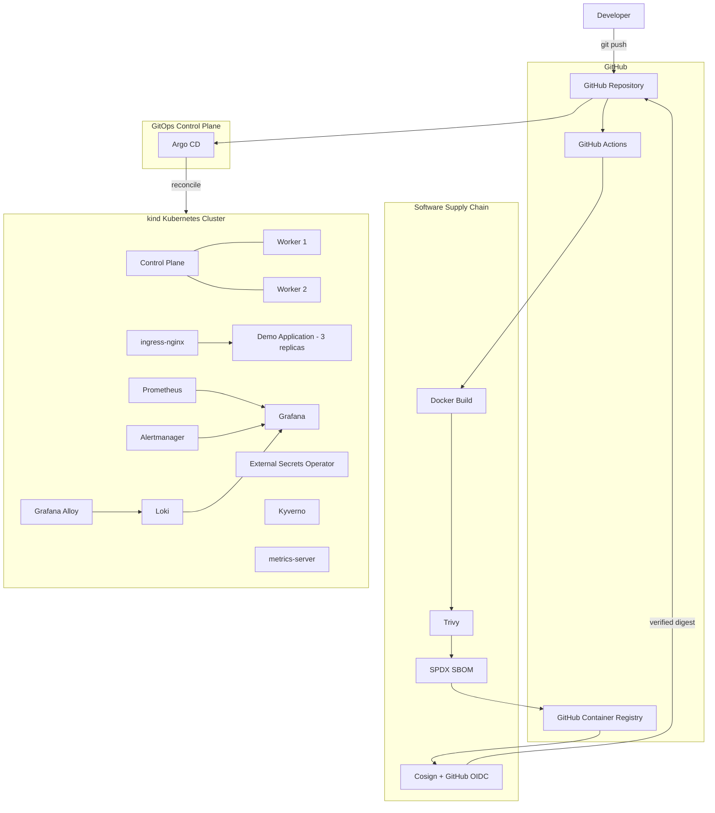
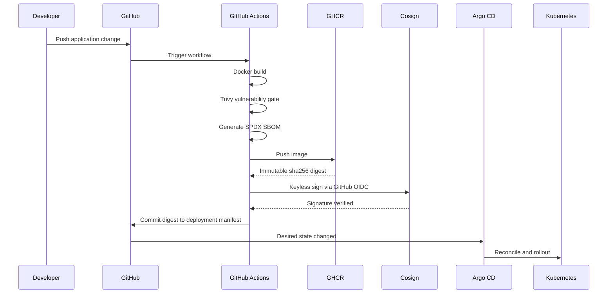

# Platform Architecture

This document describes the architecture and delivery model of the local Platform Engineering / DevOps lab.

## High-Level Architecture



## Cluster

The local environment is a three-node Kubernetes cluster created with `kind`:

- 1 control-plane node
- 2 worker nodes
- Docker-backed networking
- host port forwarding for HTTP/HTTPS through ingress-nginx

The demo workload runs with three replicas across the worker nodes.

## Delivery Architecture

The CI/CD design intentionally separates **artifact production** from **cluster reconciliation**.

### CI responsibilities

GitHub Actions:

1. checks out source code;
2. builds the Docker image;
3. scans the image with Trivy;
4. blocks on fixable HIGH or CRITICAL vulnerabilities;
5. generates an SPDX JSON SBOM;
6. publishes the image to GHCR;
7. resolves the immutable registry digest;
8. signs the digest with Cosign using GitHub OIDC;
9. verifies the signature;
10. updates `apps/demo/deployment.yaml`;
11. commits the new desired state back to Git.

### CD responsibilities

Argo CD:

1. watches `main`;
2. detects the GitOps manifest update;
3. compares desired and live state;
4. automatically synchronizes the application;
5. prunes obsolete resources;
6. self-heals manual drift;
7. rolls out the new immutable image digest.

GitHub Actions does **not** need Kubernetes credentials and does not directly run `kubectl apply`.

## Software Supply Chain



## Immutable Deployment Model

The Kubernetes Deployment references the container image by digest:

```text
ghcr.io/tortelloste/devops-lab-demo@sha256:<digest>
```

This guarantees that the workload running in Kubernetes is the exact artifact that passed security scanning and signing.

Mutable tags such as `latest` may exist in the registry for convenience, but they are not used as the deployment source of truth.

## GitOps Reconciliation

Argo CD is configured with:

- automated synchronization
- self-healing
- automatic pruning
- namespace creation

Manual drift has been tested: changes applied directly to Kubernetes are automatically reconciled back to the state defined in Git.

## Traffic Flow

```text
Browser
    |
    v
demo.local
    |
    v
localhost:80
    |
    v
kind control-plane
    |
    v
ingress-nginx
    |
    v
Kubernetes Service
    |
    v
Demo Pods
```

## Observability

### Metrics

```text
Kubernetes
    ↓
Prometheus
    ↓
Grafana
```

Additional resource metrics are provided by `metrics-server`.

### Logs

```text
Kubernetes workloads
    ↓
Grafana Alloy
    ↓
Loki
    ↓
Grafana
```

### Alerts

Alertmanager is installed as part of the monitoring stack for alert routing and handling.

## Security and Policy

### Container security

- Trivy performs vulnerability scanning in CI.
- Fixable HIGH and CRITICAL findings fail the pipeline.
- SPDX SBOMs are generated for successful builds.
- Cosign performs keyless signing through GitHub OIDC.
- The signature is verified before deployment state is updated.

### Kubernetes policy

Kyverno provides policy enforcement capabilities inside the cluster.

### Secrets

- SOPS + age provide encrypted secret-file workflows.
- External Secrets Operator provides external secret integration.

## Failure Boundaries

The architecture deliberately creates several independent control points:

- A vulnerable image cannot proceed past the Trivy gate.
- An unsigned or unverifiable image cannot update desired deployment state.
- CI cannot directly mutate the Kubernetes cluster.
- Manual cluster drift is corrected by Argo CD.
- Kubernetes deploys an immutable digest rather than a mutable tag.

These boundaries make the delivery process easier to reason about and closer to production Platform Engineering patterns.
