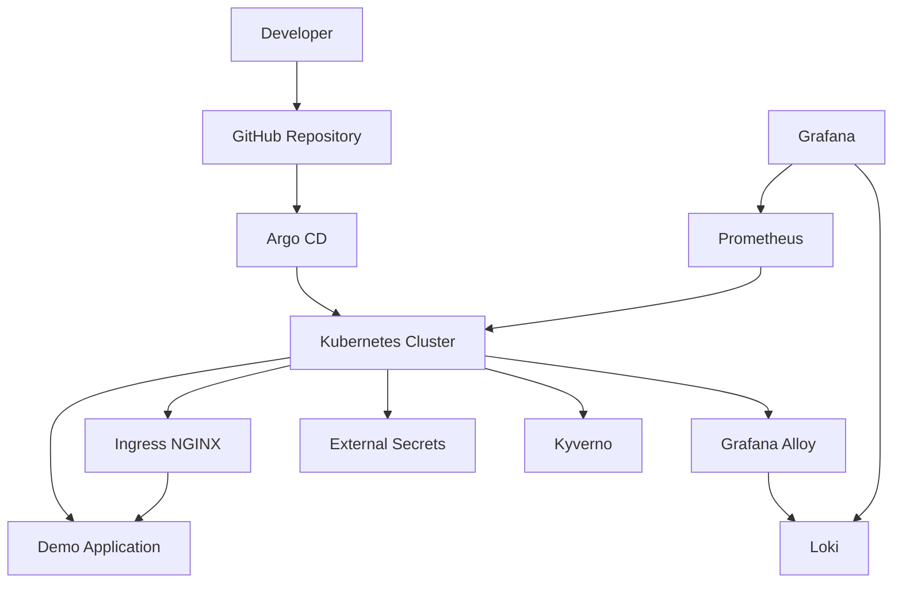

# Architecture



## Cluster

The local environment consists of:

- 1 Kubernetes control-plane node
- 2 Kubernetes worker nodes
- Docker-backed kind networking

HTTP and HTTPS traffic from the host are forwarded to the control-plane node.

## GitOps Flow

Argo CD watches the GitHub repository and continuously reconciles the desired state with the Kubernetes cluster.

```text
Developer
    |
    v
GitHub Repository
    |
    v
Argo CD
    |
    v
Kubernetes Cluster
    |
    +--> Demo Application
    +--> Ingress
    +--> Observability
    +--> Security Controls
```

## Observability

The cluster observability stack includes:

- Prometheus for metrics collection
- Grafana for dashboards and visualization
- Alertmanager for alert handling
- metrics-server for Kubernetes resource metrics
- Loki for centralized logs
- Grafana Alloy for log collection

## Security and Policy

The lab includes:

- Kyverno for Kubernetes policy enforcement
- External Secrets Operator for secret integration
- SOPS + age for encrypted secret files
- Trivy for vulnerability scanning
- Cosign for container signing

## Traffic Flow

```text
Browser
    |
    v
demo.local
    |
    v
localhost:80
    |
    v
kind control-plane
    |
    v
ingress-nginx
    |
    v
Kubernetes Service
    |
    v
Demo Pods
```
